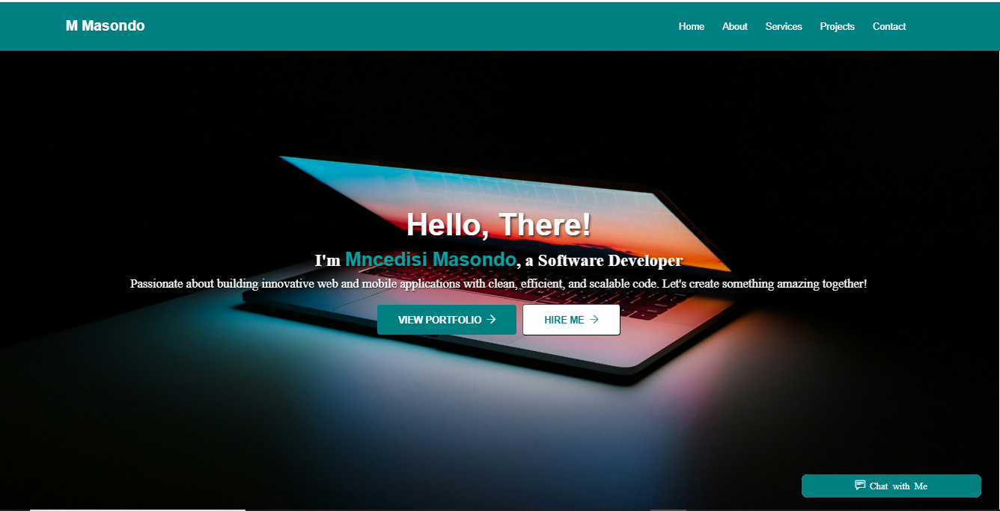
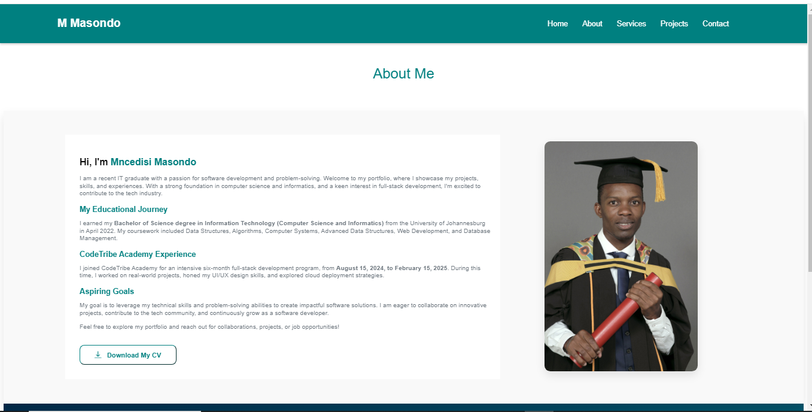
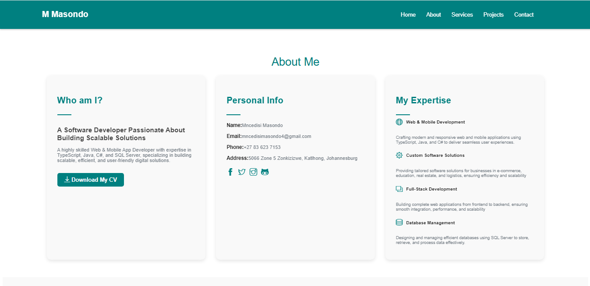
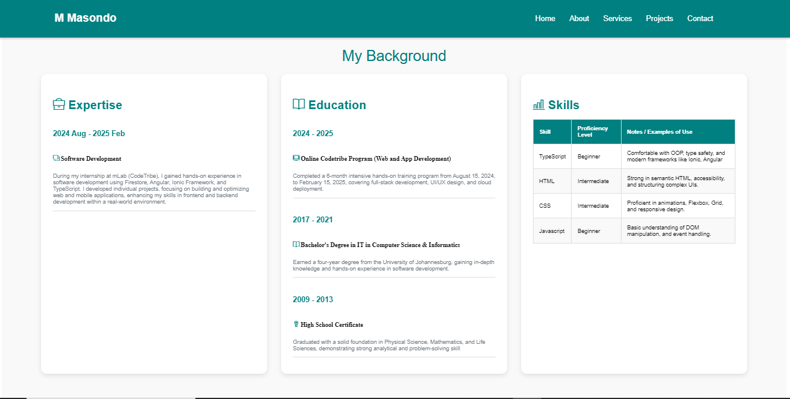
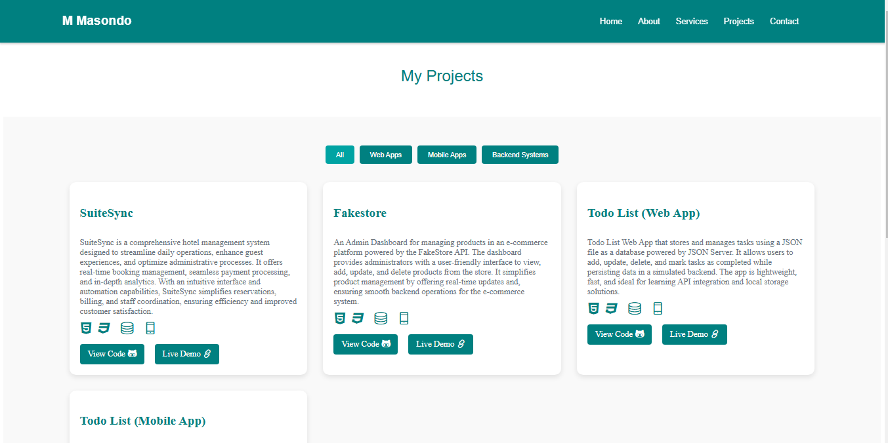
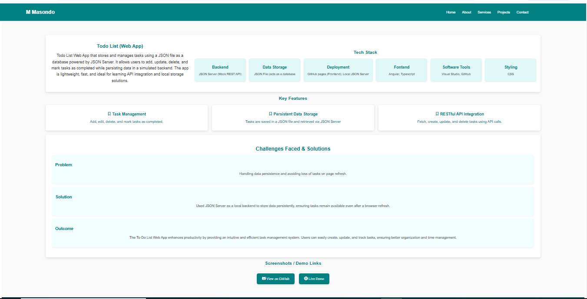
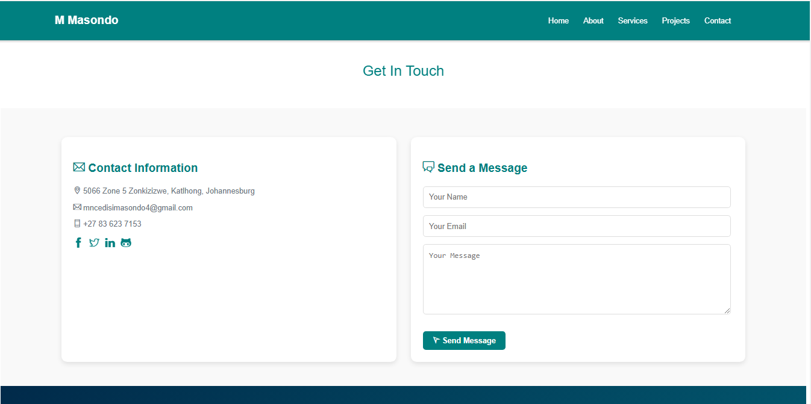

# 📖 Table of Content

1. [Overview](#overview)
2. [Features](#features)
3. [Tech Stack](#️tech-stack)
4. [Installation](#installation)
5. [Screenshots](#screenshots)
6. [Live Demo](#live-demo)
7. [Contact](#contact)
8. [Contributors](#contributors)

## 📌Overview

Welcome to my personal portfolio website! This site showcases my projects, skills, and experience as a software developer.

## 🚀Features

- **About Me** – A brief introduction about myself.
- **Projects** – Showcases my work with descriptions and live demos.
- **Skills** – Highlights the technologies and tools I specialize in.
- **Contact** – Provides ways to reach out to me.
- **Responsive Design** – Works on all devices (desktop, tablet, and mobile).

## 🛠️Tech Stack

- **Frontend**: HTML, CSS, Typescript, Angular.
- **Database**: JSON File.
- **Deployement** - GitHub Pages.
- **Software tools** - Visual Studio Code and GitHub.

## 📦Installation

1. Clone the repository: git clone [https://github.com/Mncedisi95/Portfolio.git]
2. Install dependencies: npm install.
3. Start the development server: npm start.
4. Build and Deploy: npm run build and npm run deploy.
5. Switch to a specific branch: git checkout master
6. Pull changes from remote repository: git pull master
7. Run tests for the project: npm run test.
8. Run linter checks for code quality: npm run link.
9. Generate documentation for the project: npm run docs.

## 📸Screenshots

## 🌍Live Demo

This portfolio website is live at: [https://mncedisi95.github.io/Portfolio/]

## 📬Contact

- **Portfolio**: [https://mncedisi95.github.io/Portfolio/]
- **Email**: [mncedisimasondo4@gmail.com]
- **GitHub**: [Mncedisi95](https://github.com/Mncedisi95)

## 🏆Contributors

  
